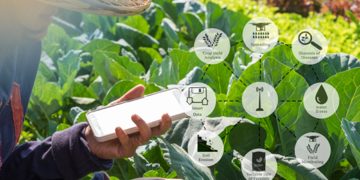
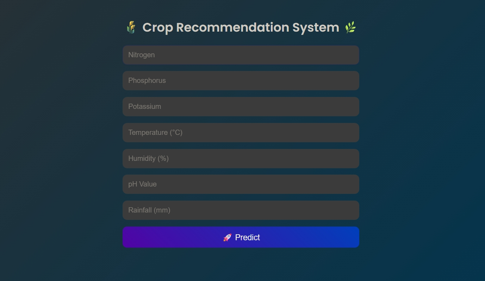
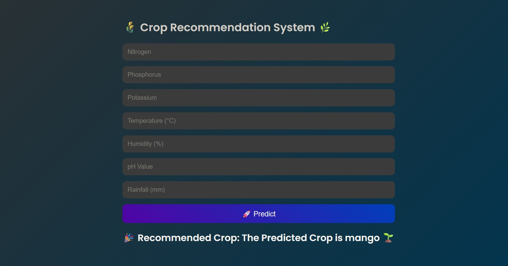

# 🌾 Crop Prediction System  

> **Empowering farmers with AI-driven crop recommendations for better yield and profits**  




---

## 📌 **Introduction**  

Agriculture remains the backbone of our economy — yet, choosing the right crop is still a challenge due to **climatic uncertainty, soil variations, and fluctuating market demands**.  

This project leverages **Machine Learning** and **real-time environmental data** to recommend the most suitable crop for cultivation. It’s built for **farmers, agricultural researchers, and policymakers** to make data-driven decisions.  

---

## 🚀 **Key Features**  

- 🔍 **Smart Crop Prediction** — Recommends crops using **soil nutrients (N, P, K)**, pH, temperature, humidity, and rainfall data.  
- 📊 **Yield & Market Insights** — Provides **estimated yield (quintal/acre)**, required fertilizers, and market trends.  
- 🌦 **Real-time Weather Integration** — Fetches live weather for accurate predictions.  
- 🌐 **User-Friendly Web App** — Built with Flask + HTML/CSS/JS for intuitive usage.  
- 📈 **Data-Driven Approach** — Trained on Kaggle’s *Crop Recommendation Dataset* with preprocessing and feature engineering.  

---

## 🗂 **Dataset Overview**  

**Source:** [Kaggle - Crop Recommendation Dataset](https://www.kaggle.com)  

| Feature | Description |
|---------|-------------|
| N, P, K | Nitrogen, Phosphorus, Potassium levels in soil |
| temperature | Temperature in °C |
| humidity | Relative humidity (%) |
| ph | Soil pH value |
| rainfall | Rainfall in mm |
| label | Recommended crop |

**Sample Data:**  

| N   | P   | K   | temperature | humidity | ph   | rainfall | label |
|-----|-----|-----|-------------|----------|------|----------|-------|
| 90  | 42  | 43  | 20.87       | 82.00    | 6.50 | 202.93   | rice |
| 78  | 42  | 42  | 20.13       | 81.60    | 7.62 | 262.71   | rice |

---

## ⚠ **Potential Data Issues & Solutions**  

| Issue | Impact | Solution |
|-------|--------|----------|
| **Outliers** in nutrient/rainfall values | Can skew predictions | Used IQR filtering & capping extreme values |
| **Imbalanced crop distribution** | Bias towards frequently occurring crops | Applied stratified sampling & class weighting |
| **Correlated features** (e.g., humidity & rainfall) | Reduces model interpretability | Performed feature importance analysis to drop redundancy |
| **Real-world mismatch** (seasonal anomalies) | Lower accuracy during unusual weather | Integrated live weather API to adjust predictions |

---

## 🛠 **Tech Stack**  

- **Language:** Python  
- **ML Libraries:** scikit-learn, pandas, numpy, matplotlib, seaborn  
- **Web Framework:** Flask  
- **Frontend:** HTML, CSS, JavaScript  
- **Weather API:** OpenWeatherMap API  

---

## 🔬 **Modeling Approach**  

1. **Data Preprocessing** – Handle outliers, normalize features, encode labels.  
2. **Exploratory Data Analysis** – Visualize relationships between NPK, weather, and crop yield.  
3. **Model Selection** – Compared Decision Tree, Random Forest, and XGBoost.  
4. **Evaluation** – Used accuracy, F1-score, and confusion matrix for performance measurement.  
5. **Deployment** – Integrated Flask app with trained model for real-time usage.  

---

## 📸 **Preview**  
## Step1
  
## Step2
  
## Step3



---

## ⚡ **How to Use**  

1. Clone this repository  
   ```bash
   git clone https://github.com/yourusername/crop-prediction.git
   cd crop-prediction
2.Install dependencies

Always show details
```bash
  pip install -r requirements.txt
```

3.Run the Flask app
```bash
  python app.py
```
## 📈 Results

- Achieved 98% accuracy on test data using Random Forest.
- Reduced misclassification of similar crops by 15% through feature scaling and hyperparameter tuning.
